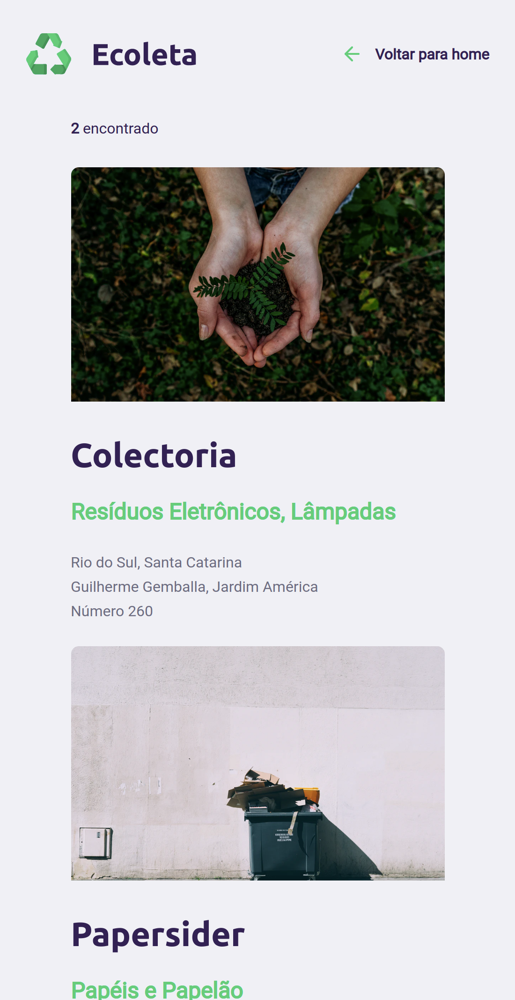

# Ecoleta

### A plataforma consiste em um site Open Source com finalidade estabelecer uma conexão entre empresas e/ou entidades que coletam resíduos (orgânicos e inorgânicos) às pessoas e/ou entidades que necessitam constantemente descartar esses resíduos.

[clique aqui](https://ecoletajs.netlify.app/) para acessar o conceito da aplicação

# Tecnologias

* HTML
* CSS
* JavaScript

# screenshot

  
  
  
  
  
  
  
  

